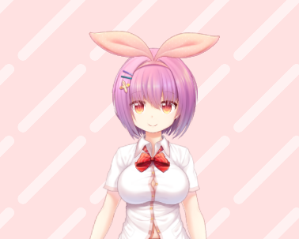

# Luna AI v10 - AI Streamer with VTube Studio Integration

<div align="center">
  <!-- Logo -->
  
  
  
  
  
  
</div>

Luna เป็น AI streamer ที่สามารถแชตกับผู้ชม แสดงอารมณ์ และควบคุม VTube Studio character ได้อัตโนมัติ

## 📑 Table of Contents

- [Features](#-features)
- [Rock Paper Scissors Game](#-rock-paper-scissors-game)
- [Requirements](#-requirements)
- [Quick Start](#-quick-start)
- [API Endpoints](#-api-endpoints)
- [Configuration](#-configuration)
- [Troubleshooting](#-troubleshooting)
- [Project Structure](#-project-structure)
- [License](#-license)

## ✨ Features

- 🤖 **AI Chat System** - ตอบแชตด้วย GPT-4o-mini (คำถามง่าย) และ GPT-4o (คำถามยาก) - เลือกอัตโนมัติตามความซับซ้อน (รองรับ OpenRouter)
- 🎭 **Emotion System** - แสดงอารมณ์ตามข้อความ (angry, sad, sleepy, hype, soft)
- 🎤 **Text-to-Speech** - สร้างเสียงด้วย ElevenLabs (รองรับหลายโหมดเสียง)
- 🎬 **VTube Studio Integration** - ควบคุม character อัตโนมัติ
  - Talk-React (ขยับปากตามเวลาพูด)
  - Breathing (หายใจอัตโนมัติ)
  - Idle Animations (การเคลื่อนไหวตอนว่าง)
  - Emotion Expressions (แสดงอารมณ์)
- 💤 **Sleepy Mode** - โหมดง่วงตามเวลา (00:00-06:00 น. ตามเวลา US)
- 💬 **Idle Monologue** - พูดพึมพำตอนเงียบ
- 💰 **Purchase Webhook** - ตอบเมื่อมีคนซื้อเหรียญ
- 🧠 **Memory System** - จำผู้ใช้และประวัติการแชต
  - Conversation History - จำบทสนทนาก่อนหน้า (5 messages)
  - Personal Preferences - จำสิ่งที่ผู้ใช้ชอบ
  - Emotion History - ติดตามอารมณ์ของผู้ใช้
  - Memory Decay - ลืม memory เก่า (เหมือนคนจริง)
- 🎨 **Personality System** - บุคลิกภาพที่เปลี่ยนแปลงตามอารมณ์
- 💬 **Natural Speech Patterns** - พูดแบบธรรมชาติ
  - Filler words (um, uh, like, you know)
  - Self-correction (Wait, actually...)
  - Asking questions back (What about you?)
  - Apologizing (Sorry, I think I misunderstood...)
  - Topic transitions (Oh, that reminds me...)
  - Occasional forgetting (จำผิดบ้าง - เหมือนคนจริง)
- 📊 **Statistics & Analytics** - ติดตามสถิติการใช้งาน, performance metrics
- 🔒 **Request Validation** - ตรวจสอบ input อัตโนมัติ
- 💾 **Response Caching** - Cache responses สำหรับคำถามซ้ำ (ประหยัด cost)
- 🛡️ **CORS Support** - รองรับ frontend จาก domain อื่น
- 🔧 **Admin Endpoints** - จัดการระบบ, ดู logs, reset statistics
- 📈 **Enhanced Health Check** - ตรวจสอบระบบแบบละเอียด
- 🐛 **Error Tracking** - บันทึกและติดตาม errors
- 🎮 **Rock Paper Scissors Game** - เกมเป่ายิงฉุบ 3 โหมด (PvP, VS Luna, Betting)

## 🎮 Rock Paper Scissors Game

Luna มีเกม Rock Paper Scissors 3 โหมด:

### 🎯 PvP Mode
- เล่นกับผู้เล่นอื่น
- ต้องการ **100K+ Luna tokens**
- Auto-matchmaking (รอ 15 วินาทีเพื่อเจอ bot ถ้าไม่มีคน)
- URL: `/rps_game.html`

### 🤖 VS Luna Mode
- เล่นกับ Luna (AI)
- ต้องการ **1M+ Luna tokens**
- เล่นได้ทันทีไม่ต้องรอ
- URL: `/rps_vs_luna.html`

### 💰 Betting Mode
- สร้างห้องเดิมพันด้วย Luna tokens
- ผู้เล่นสามารถสร้างและเข้าร่วมห้องได้
- ชนะได้ Luna tokens
- URL: `/rps_betting.html`

**Features:**
- ✅ Real-time balance checking
- ✅ WebSocket for live updates
- ✅ Phantom Wallet integration
- ✅ Auto-matchmaking with bot fallback
- ✅ Room-based betting system

## 📋 Requirements

- Node.js 18+ 
- VTube Studio (สำหรับ character control)
- API Keys:
  - OpenAI หรือ OpenRouter (สำหรับ AI)
  - ElevenLabs (สำหรับ TTS - optional)

## 🚀 Quick Start

### 1. ติดตั้ง Dependencies

```bash
npm install
```

### 2. ตั้งค่า Environment Variables

คัดลอก `env.example` เป็น `.env` และกรอกค่าตามที่ต้องการ:

```bash
cp env.example .env
```

ดูรายละเอียดใน `env.example` หรือ `VTS_SETUP_GUIDE.md`

### 3. ตั้งค่า VTube Studio

ดูคู่มือการตั้งค่าใน `VTS_SETUP_GUIDE.md`

**สรุป:**
- เปิด VTube Studio → Settings → API → Enable API
- สร้าง Hotkeys 11 ตัว (ดูรายชื่อใน `VTS_SETUP_GUIDE.md`)
- ขอ Authentication Token: `node scripts/vts/vts-auth.cjs`
- ใส่ Token ใน `.env` ที่ `VTS_AUTH_TOKEN=...`

### 4. รัน Server

```bash
npm start
```

Server จะรันที่ `http://localhost:8787` (หรือ port ที่ตั้งใน `.env`)

## 📡 API Endpoints

### Chat

**POST** `/luna/message`
- ส่งข้อความไปหา Luna
- Body: `{ "text": "Hello Luna", "user": "username" }`
- Response: `{ "ok": true, "reply": "...", "emotion": "...", "ttsUrl": "..." }`

### Status

**GET** `/luna/status`
- ตรวจสอบสถานะระบบ
- Response: `{ "ok": true, "vts": {...}, "tts": {...}, "ai": {...} }`

**GET** `/luna/health`
- Health check สำหรับ monitoring (ปรับปรุงแล้ว)
- Response: `{ "ok": true, "status": "healthy", "checks": {...}, "resources": {...} }`
- ตรวจสอบ: server, database, VTS, AI, TTS, memory usage

**GET** `/luna/stats`
- สถิติการใช้งานระบบ
- Response: `{ "ok": true, "messages": {...}, "performance": {...}, "system": {...} }`
- แสดง: จำนวน messages, emotion distribution, model usage, cache hit rate, response time

### VTube Studio

**GET** `/luna/vts/parameters`
- ดู parameters ที่มีใน VTube Studio
- Response: `{ "ok": true, "allParameters": [...], ... }`

**GET** `/luna/expression?emo=angry`
- ทดสอบ emotion expression
- Query: `emo` = `angry`, `sad`, `sleepy`, `hype`, `soft`, `clear`

### Control

**GET** `/luna/wake`
- บังคับให้ Luna ตื่น (ปิด sleepy mode ชั่วคราว)

**GET** `/luna/allow-sleep`
- เปิดใช้งาน sleepy mode อีกครั้ง

### Purchase Webhook

**POST** `/purchase`
- Webhook สำหรับแจ้งเมื่อมีคนซื้อเหรียญ
- Headers: `x-purchase-secret` (ถ้าตั้ง `PURCHASE_SECRET`)
- Body: `{ "buyer": "username", "amount": 10, "currency": "SOL" }`
- Validation: ตรวจสอบ buyer, amount, currency อัตโนมัติ

### Admin Endpoints

**หมายเหตุ:** Admin endpoints ต้องมี `ADMIN_SECRET` ใน `.env` และส่ง header `x-admin-secret` หรือ query `?secret=...`

**GET** `/luna/admin/clear-memory?user=username`
- ลบ memory ของ user (หรือทั้งหมดถ้าไม่ระบุ user)
- Headers: `x-admin-secret` หรือ Query: `?secret=...`

**GET** `/luna/admin/reset-personality`
- Reset personality ของ Luna
- Headers: `x-admin-secret` หรือ Query: `?secret=...`

**GET** `/luna/admin/clear-cache`
- ลบ response cache ทั้งหมด
- Headers: `x-admin-secret` หรือ Query: `?secret=...`

**GET** `/luna/admin/errors?limit=50`
- ดู error logs (ล่าสุด 50 รายการ)
- Headers: `x-admin-secret` หรือ Query: `?secret=...`

**GET** `/luna/admin/reset-stats`
- Reset statistics ทั้งหมด
- Headers: `x-admin-secret` หรือ Query: `?secret=...`

## 🎮 VTube Studio Setup

ดูคู่มือการตั้งค่าแบบละเอียดใน `VTS_SETUP_GUIDE.md`

### Hotkeys ที่ต้องสร้าง (11 ตัว):

**Emotion Hotkeys:**
- `emotion_angry` - อารมณ์โกรธ
- `emotion_sad` - อารมณ์เศร้า
- `emotion_sleepy` - อารมณ์ง่วง
- `emotion_hype` - อารมณ์ตื่นเต้น
- `emotion_soft` - อารมณ์อ่อนโยน
- `emotion_clear` - กลับหน้า default

**Idle Hotkeys:**
- `emotion_look_away` - มองไปทางอื่น
- `emotion_tilt` - เอียงหัว
- `emotion_small_surprise` - ตกใจเล็กน้อย
- `emotion_hum` - ทำเสียงฮัม
- `emotion_moment_sad` - เศร้าแป๊บเดียว

### Parameters ที่ต้องมี:

- `MouthOpen` - ควบคุมการเปิดปาก (0.0 - 1.0)
- `FaceAngleX`, `FaceAngleY`, `FaceAngleZ` - หมุนหัว
- `Breath` - การหายใจ (0.0 - 1.0)

## ⚙️ Configuration

### Environment Variables

ดูรายละเอียดใน `env.example`

**สำคัญ:**
- `VTS_ENABLED=true` - เปิดใช้งาน VTube Studio
- `VTS_AUTH_TOKEN=...` - Token จาก VTube Studio
- `OPENAI_KEY` หรือ `OPENROUTER_KEY` - API key สำหรับ AI
- `ELEVEN_KEY` - API key สำหรับ TTS (optional)
- `TTS_ENABLED=true/false` - เปิด/ปิด TTS

**CORS Configuration:**
- `CORS_ORIGINS=*` - Allow all origins (default)
- `CORS_ORIGINS=http://localhost:3000,https://example.com` - กำหนด allowed origins

**Admin Configuration:**
- `ADMIN_SECRET=your_secret_here` - Secret key สำหรับ admin endpoints (optional)

**Model Selection (Auto-select based on question complexity):**
- `SIMPLE_MODEL=gpt-4o-mini` - Model สำหรับคำถามง่าย (default)
- `COMPLEX_MODEL=anthropic/claude-3-opus` - Model สำหรับคำถามยาก (default - แนะนำ!)
- `FALLBACK_MODEL=gpt-4o-mini` - Model สำรองเมื่อเกิด error

**ทำไมเลือก Claude-3-Opus?**
- ✅ ประสิทธิภาพสูงกว่า GPT-4o ในการวิเคราะห์และ reasoning
- ✅ ชนะ GPT-4o ในการประเมินงานจริง (47.6% vs 12.4%)
- ✅ อันดับ 1 ใน Chatbot Arena
- ✅ ดีกว่าในการตอบคำถามซับซ้อน

**หมายเหตุเกี่ยวกับ GPT-5:**
- GPT-5 ยังไม่มีใน OpenAI API และ OpenRouter (ณ วันที่เขียน)
- ระบบรองรับการกำหนด model เองใน `.env`
- ถ้า GPT-5 เปิดตัวแล้ว → เปลี่ยน `COMPLEX_MODEL=gpt-5` ได้เลย
- Model ที่รองรับ: `gpt-4o`, `gpt-4o-mini`, `gpt-4-turbo`, `gpt-3.5-turbo`
- หรือ model อื่นๆ จาก OpenRouter: `anthropic/claude-3-opus`, `openai/gpt-4o`, `gemini-pro`, `llama-3-70b`, etc.

**ระบบจะเลือก model อัตโนมัติ:**
- **คำถามง่าย** → ใช้ `SIMPLE_MODEL` (ประหยัด cost)
  - คำถามสั้นๆ, คำทักทาย, คำถามทั่วไป
- **คำถามยาก** → ใช้ `COMPLEX_MODEL` (ความแม่นยำสูง)
  - คำถามยาว, คำถามซับซ้อน (why/how/explain), คำศัพท์เทคนิค, คำถามหลายคำถาม

## 🐛 Troubleshooting

### VTS ไม่ Authenticated

1. ตรวจสอบว่า VTube Studio เปิดอยู่
2. ตรวจสอบว่า API เปิดอยู่ (Port 8001)
3. รัน `node scripts/vts/vts-auth.cjs` เพื่อขอ token ใหม่
4. ใส่ token ใน `.env` ที่ `VTS_AUTH_TOKEN=...`
5. Restart server

### Emotion ไม่ทำงาน

1. ตรวจสอบว่า VTS authenticated (`/luna/status`)
2. ตรวจสอบว่า hotkeys ทั้งหมด 11 ตัวมีชื่อตรงกันทุกตัว
3. ตรวจสอบว่า hotkeys เปิดใช้งาน (ON)

### ปากไม่ขยับ

1. ตรวจสอบว่า parameter `MouthOpen` มีใน VTube Studio
2. ตรวจสอบ mapping ใน VTube Studio (Input: 0-1, Output: 0-1)
3. ตรวจสอบ Smoothing (แนะนำ: 3-5)

### Luna ไม่พูด

1. ตรวจสอบว่า `TTS_ENABLED=true` ใน `.env`
2. ตรวจสอบว่า `ELEVEN_KEY` ถูกต้อง
3. ตรวจสอบ status ที่ `/luna/status`

## 📁 Project Structure

```
LunaAI_v10_Project/
├── index.js              # Main server
├── modules/
│   ├── ai.js            # AI/LLM integration
│   ├── vts.js           # VTube Studio integration
│   ├── tts.js           # Text-to-Speech
│   ├── classifier.js    # Emotion classification
│   ├── memory.js        # User memory
│   ├── personality.js   # Personality system
│   ├── db.js            # Database
│   ├── solana.js        # Solana integration
│   └── pumpfun.js       # Pump.fun integration
├── public/              # Static files
│   ├── rps_game.html    # PvP Mode
│   ├── rps_vs_luna.html # VS Luna Mode
│   ├── rps_betting.html # Betting Mode
│   ├── chat_tester.html
│   ├── overlay.html
│   └── tts/            # TTS audio files
├── deploy/             # Deployment configs
├── VTS_SETUP_GUIDE.md  # VTube Studio setup guide
└── README.md          # This file
```

## 🔧 Development

### Testing

```bash
# Run all unit tests
npm test

# Run unit tests only
npm run test:unit

# Run backend system tests
npm run test:backend

# Run all system tests
npm run test:all

# Run specific test file
node --test tests/unit/classifier.test.js

# Test VTS connection
node tests/test-vts.cjs

# Test environment variables
node tests/test-env.cjs

# Get VTS auth token
node scripts/vts/vts-auth.cjs
```

**ดูคู่มือการทดสอบ:** `tests/README.md`

### Deployment

ดู `deploy/README_DEPLOY.md` สำหรับการ deploy

**PM2:**
```bash
pm2 start configs/ecosystem.config.cjs
pm2 save
```

**Systemd:**
```bash
sudo cp deploy/luna.service /etc/systemd/system/
sudo systemctl daemon-reload
sudo systemctl enable luna
sudo systemctl start luna
```

## 📝 License

MIT

## 🤝 Support

- ดู `VTS_SETUP_GUIDE.md` สำหรับการตั้งค่า VTube Studio
- ตรวจสอบ status ที่ `http://localhost:8787/luna/status`
- ตรวจสอบ health ที่ `http://localhost:8787/luna/health`

---

**Made with ❤️ for Luna AI Streamer**

